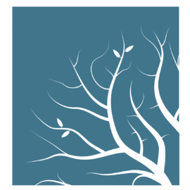
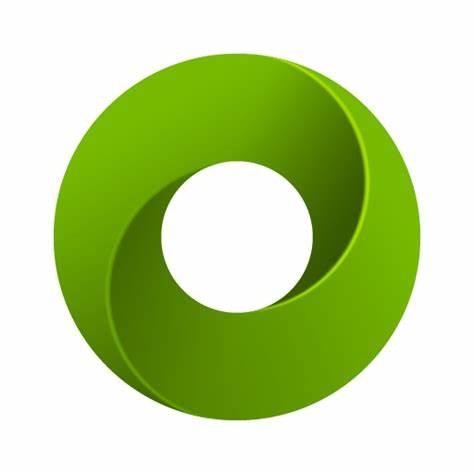

### Hi! :grin:

I'm Austen, a programmer :computer:, who is passionate about architecture :house_with_garden:. My interest in machine learning led me to start "[Generlate](https://www.youtube.com/@generlate)", a series of projects exploring generative ai. One day, I want to build machine-generated and managed cities!

---

### Languages and Tools

