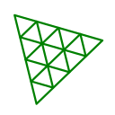

### Hi! :grin:

I'm Austen, a programmer :computer: with a passion for architecture :house_with_garden:. When I'm not programming, I'm talking about both on Youtube [@Generlate](https://www.youtube.com/@generlate). One day, I want to build machine-generated and managed cities!

---

### Languages and Tools

#

  

###  Recent Youtube Videos

<!-- BEGIN YOUTUBE-CARDS -->

[ Plug-in for Photoshop")](https://www.youtube.com/watch?v=fEWRX5fE3K4)

[ Architect recreates past renderings with Dall-e")](https://www.youtube.com/watch?v=VYLTWzvRqk4)

<!-- END YOUTUBE-CARDS -->

<h3>📃 My Story</h3>

Twelve-year-old Austen had aspirations of producing music. I got really into playing clarinet and saxophone for a ton of different bands. I even made it on <a href="https://open.spotify.com/track/1Yuxi8K5PKHEMXpXih96ns?si=0570155ecaaa4e60">Spotify!</a> I'm still nostalgic about those days.
  Yet, I decided that music was ultimately not for me, six years in. The Philadelphia philharmonic had just gone bankrupt. Plus, I was burnt out from overcommitting myself. So, I looked for a new major for college.
  The answer I found was architecture, which shared a lot of enjoyable traits with music, like creativity and skill. It also had some improvements, like not requiring lifelong practice, permanence, being less competitive and related to housing. The 2008 housing crash impacted my teenage years a lot, and I saw getting into the industry as a way of learning how to prevent any problems for myself. So, I went to Florida International University to become an architect.
  My journey took an unexpected turn when I applied late to Florida International University. The architecture program was already full, but there was a spot for me in landscape architecture. So, I took it. The classes are the same for the first half of the program anyway. So, I had until junior year to reconsider my major.
  Three years passed, filled with extensive design projects and rendering work. During this period, I was introduced to GPUs, and I noticed the rise of machine learning. In my final year, I embarked on a semester of research. Having a growing interest in technology and its role in augmenting my design process, I researched sci-fi. What I found was the transhumanist movement and a clearer vision of the future.
  Upon graduating, I made a bold decision. Rather than becoming a traditional architect, I aimed to revolutionize the field by designing the tools architects use. I planned a startup, launched a YouTube channel, and immersed myself in computer science. I eventually took a year off to study computer science and engineering through MIT, equipping myself with the skills needed for design automation and software development.

